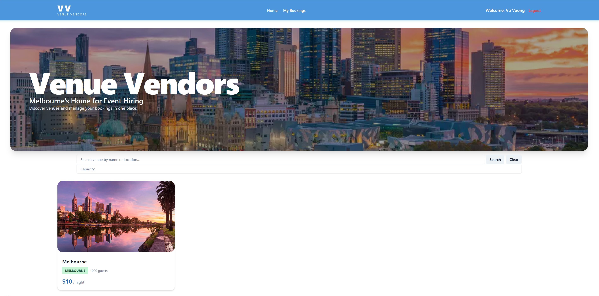
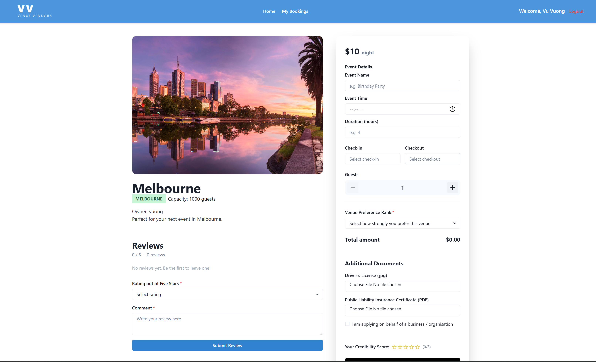
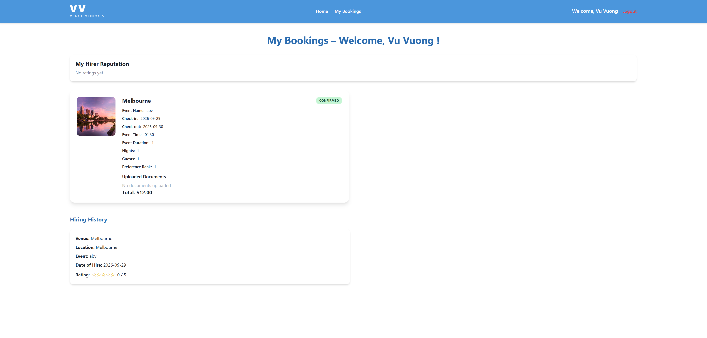
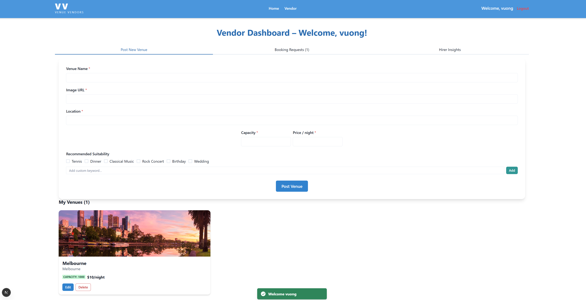

# Full Stack Development Assignment: Venue Vendors Website

## Image ##
**Home Page**

**Venue Page**

**Booking Page**

**Vendor Page**

## Student ##
Student 1: Vu Vuong Nguyen / s3969801
Student 2: Caroline Forster / s4088927

## Tech Stack
Frontend: React TypeScript / Next.js / Chakra UI  
Backend: Node.js / Express / TypeORM  
Database: Cloud MS SQL Server  

## How to Run

### Backend
cd backend
npm install
npm run build
npm run dev

Backend runs on:
http://localhost:3001

### Frontend
cd frontend
npm install
npm run build
npm run dev

Frontend runs on:
http://localhost:3000

## Features Implemented

- Sign up and sign in with database storage
- Complex password validation
- Hirer profile
- Hirer can check a venue’s ‘recommended suitability’ 
- Vendor venue CRUD
- Hirer venue browsing and booking
- Booking accept/reject workflow
- Blocked venue dates
- Compliance documents and credibility score
- Hirer reputation ratings
- Vendor analytics charts for DI section
